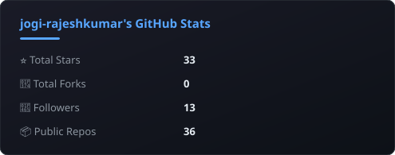
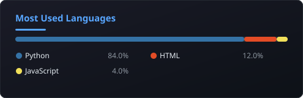
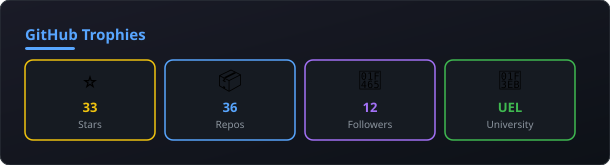

---

## 🧠 Professional Profile

> MSc Artificial Intelligence student with **3+ years** of professional experience specialising in **Computer Vision**, **Machine Learning**, and **Real-Time Analytics**. Proven track record in leading teams to deploy production-level ML modules that optimise system latency and throughput. Currently researching **privacy-preserving Federated Learning** for EEG-based emotion recognition on edge devices. Expert in building cross-platform AI applications and robust security solutions for **healthcare, finance, and government** sectors.

---

## 💼 Professional Experience

### 🟢 AI Agent Developer — Green Environment Ltd, London *(Oct 2025 – Present)*
- 🤖 Designing intelligent AI-driven systems to enhance automation for **ECO4** and **GBIS** initiatives
- 🌱 Applying Computer Vision & ML to real-world **sustainability challenges** within the Green Deal sector
- 🔗 Collaborating with data engineering and energy assessment teams through R&D

### 🔵 Computer Vision Software Engineer (Team Lead) — Boolean Brain Technologies *(Dec 2023 – Aug 2024)*
- ⚡ Led a team integrating Python ML modules into production, reducing **API latency by 25%**
- 🔧 Refactored legacy inference model code, boosting **system throughput by 1.6×**
- 🌐 Developed customised Django web applications, decreasing **support tickets by 30%**

### 🟠 Computer Vision Engineer — Timing Technologies India Pvt. Ltd *(May 2023 – Nov 2023)*
- 🏛️ Built **facial recognition** and Bib Detection apps for Government Selections across Indian states
- 🔒 Deployed a secure examination browser on **100+ client devices** using PyInstaller
- 🎯 Fine-tuned **YOLOv5** and **ResNet-50** for edge deployment, achieving **>90% precision**

### 🟡 AI/ML Intern — ThoughtGreen Technologies *(Jan 2023 – Apr 2023)*
- 📚 Researched Bib detection algorithms; trained models with **PyTorch** and **TensorFlow**
- 🔬 Executed comprehensive model testing, evaluation, and hyperparameter optimisation

### 🔴 Freelance ML Developer — Independent *(2020 – 2022)*
- 👤 Designed biometric facial attendance and fraud detection systems
- 🛠️ Delivered bespoke tools for clients in **finance, transportation, and administration**

---

## 🎓 Education

**🏫 MSc Artificial Intelligence (with Industrial Placement)**
University of East London, London, UK | *Sept 2024 – May 2026*

| Module | Focus |
|--------|-------|
| Intelligent Systems | AI Planning & Reasoning |
| Big Data Analytics | Distributed Processing at Scale |
| Machine Learning on Big Data | Large-scale ML Pipelines |

> 📌 **Dissertation:** *Federated Learning for EEG-Based Emotion Recognition Across Edge Devices*

---

## 🚀 Key Projects

| Project | Description | Stack |
|---------|-------------|-------|
| 🧠 **eeg-fl-emotion** | Privacy-preserving emotion recognition via Federated Learning | PyTorch, FedAvg, Edge Devices |
| 🛰️ **Satellite Object Recognition** | Memory-efficient deep learning for fine-grained classification | Keras, CNNs, FAIR1M Dataset |
| 🎭 **Real-Time Face Analysis** | Live browser-based age, emotion & gender detection | Flask, PyTorch, face-api.js |
| 👁️ **Real-Time CV Monitoring** | Eye state detection & gesture-based volume control | MediaPipe, OpenCV, Dlib |
| 📈 **Financial Portfolio Optimizer** | Stock market optimisation & automated data pipelines | Pandas, NumPy |
| 🖥️ **DevOps Server Monitor** | Server uptime monitor with Telegram alerts | Python, Telegram API |

---

## 🛠️ Technical Arsenal

---

## 📊 GitHub Analytics

<table>
<tr>
<td align="center" width="50%">

</td>
<td align="center" width="50%">

</td>
</tr>
<tr>
<td align="center" width="50%">

</td>
<td align="center" width="50%">

</td>
</tr>
</table>

---

## 📌 Featured Repositories

<table>
<tr>
<td align="center" width="33%">

</td>
<td align="center" width="33%">

</td>
<td align="center" width="33%">

</td>
</tr>
<tr>
<td align="center" width="33%">

</td>
<td align="center" width="33%">

</td>
<td align="center" width="33%">

</td>
</tr>
</table>

---

## 🏆 Certifications

| 🎖️ Certificate | 🏢 Issuer |
|----------------|----------|
| 🤖 Career Essentials in Generative AI | Microsoft & LinkedIn |
| 👁️ OpenAI API: Vision | LinkedIn Learning |
| 🐳 Docker Foundations Professional Certificate | Docker, Inc. |
| 🧮 ML Algorithms | Great Learning |
| 🍓 Raspberry Pi Emergency Alert Helmet — Edge AI | EC-Council |
| 🔐 SQL Injection Attacks — Cybersecurity | EC-Council |
| 🌐 HTML for Programmers | LinkedIn Learning |
| 📡 Networking Fundamentals | Udemy |
| 💼 AI and Business Strategy | LinkedIn |

---

## 📬 Let's Connect

---

*🔄 README auto-updated on **31 May 2026, 09:15 UTC** via GitHub Actions*

